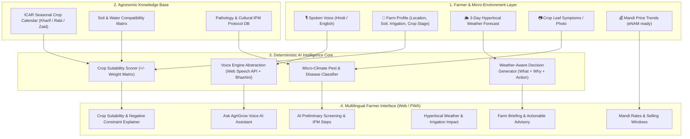

# AgriGrow — AI-Powered Farm Intelligence & Advisory Platform
> **Smart India Hackathon 2026** • Problem Statement ID: **26193**  
> *Category:* Student Innovation in Agriculture • Primary Sector Enhancement

---

## 🌾 Overview & Vision
Indian agriculture is dominated by small and marginal farmers (averaging < 2 acres), who face increasing climate volatility, fragmented advisory channels, and market asymmetries. Generic black-box LLMs fail farmers by generating hallucinatory recommendations (e.g., suggesting winter wheat in monsoon July).

**AgriGrow** solves this through a **hybrid architecture**:
1. **Deterministic Agricultural Rule Engine:** Grounded strictly in Indian Council of Agricultural Research (**ICAR**) crop calendars, agro-ecological regional zones, and soil-water matrices.
2. **Hyperlocal Weather-Aware Decision Advisory:** Directly translates 3-day micro-climate forecasts into actionable, non-ambiguous farm operations (*"Delay irrigation today; unclog furrow drains"*).
3. **AI Crop Health Screening & Cultural IPM:** Computer vision symptom detection with transparent confidence scoring, paired with non-chemical cultural management before escalating to chemical interventions.
4. **Accessible Multilingual Voice Engine:** Built-in Hindi and English speech-to-text (ASR) and text-to-speech (TTS) with fail-safe audio chimes, designed for low-literacy adoption and ready for Digital India **Bhashini** integration.
5. **Mandi Market Intelligence:** Modal price tracking, multi-market comparison (e.g., Pithoragarh vs. Haldwani), and price trajectory analytics.

---

## 🏛️ System Architecture



---

## 🌟 The Hero Demonstration Scenario

To ensure zero ambiguity during jury evaluation and video recording, AgriGrow is pre-loaded with an agro-ecologically sound, verified scenario:

* **Location:** Pithoragarh District, Kumaon Region, Uttarakhand (Hilly terrace ecosystem).
* **Farm Size & Soil:** 2.0 Acres, Rainfed terrace, Loamy soil (pH 6.6, adequate organic carbon).
* **Active Crop:** Kharif Maize, Day 42 (Vegetative Stage).
* **Weather Trigger:** 
  * Current: 28°C, Partly Cloudy, 72% humidity, 68% soil moisture.
  * **Tomorrow:** **70% probability of 18mm rainfall**, relative humidity surging to **84%**.
* **Generated Decision (What + Why + Action):**
  * **Action:** *"Delay scheduled irrigation today. Clear field drainage furrows."*
  * **Agronomic Rationale (Why?):** Soil moisture is already optimal (68%). Adding water before an 18mm rainstorm induces waterlogging, suffocates root respiration, and elevates fungal spore germination.
  * **Risk Alert:** *Moderate Fungal Disease Risk (Maydis Leaf Blight)* due to prolonged leaf wetness.
  * **Market Insight:** Pithoragarh Mandi maize modal rate is **₹2,350/Qtl** (+4.2% weekly gain).

---

## 🔬 Deterministic ICAR Rule Engine & Negative Constraint Proof

Unlike generative chatbots that can give plausible-sounding but catastrophic farming advice, AgriGrow calculates a deterministic suitability score:

$$\text{Suitability Score} = S_{\text{season}} + S_{\text{month}} + S_{\text{soil}} + S_{\text{water}} + S_{\text{region}}$$

### The Kharif vs. Rabi Negative Reasoning Test
When evaluated in **July Kharif** in Uttarakhand:
* **Maize (Kharif Crop):** 
  * Season Match (+35) + July Sowing Window (+25) + Loamy Soil (+20) + Rainfed Compatible (+15) + Regional Adaptability (+15) = **95/100 (HIGH SUITABILITY)**.
* **Wheat (Rabi Crop):** 
  * Season Mismatch (**-50 penalty**) + Outside Sowing Window (**-25 penalty**) + Soil (+20) + Rainfed (+15) = **-35 (REJECTED / UNSUITABLE)**.
  * *Negative Explanation Rendered:* *"Wheat is primarily a Rabi crop. Sowing during July Kharif disrupts the photoperiod and thermal vernalization required for physiological development."*

Farmers and judges can flip between **Kharif** and **Rabi** on the Crop Planner to observe the algorithm dynamically promote and demote crops based on ICAR rules.

---

## 🚀 Running the Prototype Locally

### Prerequisites
* Node.js (v18 or higher)
* Modern web browser (Chrome, Edge, Safari, or Firefox)

### Steps
```bash
# 1. Navigate to the project directory
cd C:\Users\himesh\.gemini\antigravity\scratch\agrigrow

# 2. Install dependencies (React 18, Vite 6, Tailwind CSS 3, Lucide Icons)
npm install

# 3. Launch Vite development server
npm run dev
```

The application will be live at `http://localhost:5173`.

---

## 🇮🇳 Digital India & DPI Integration Readiness

AgriGrow is architecturally prepared to integrate with key Government of India digital public infrastructure:
* **AgriStack / Farmer Registry:** Farmer ID binding and digitized land parcel registry.
* **e-NAM & Agmarknet:** Automated daily mandi modal price and arrival quantity feeds.
* **Soil Health Card (SHC):** Ingestion of NPK, micro-nutrient, and pH lab test values.
* **Bhashini (National Language Translation Mission):** Direct replacement of browser Web Speech with Bhashini's Indic speech APIs via `src/services/voice/voiceService.js`.
* **Krishi DSS & IMD Mausam:** Hyperlocal block-level agro-meteorological advisory bulletins.

---

## 👥 Team & Submission Information
* **Problem Statement:** SIH 26193
* **Title:** Student Innovation in Agriculture — Enhancing the Primary Sector of India
* **Platform:** AgriGrow Web / PWA
